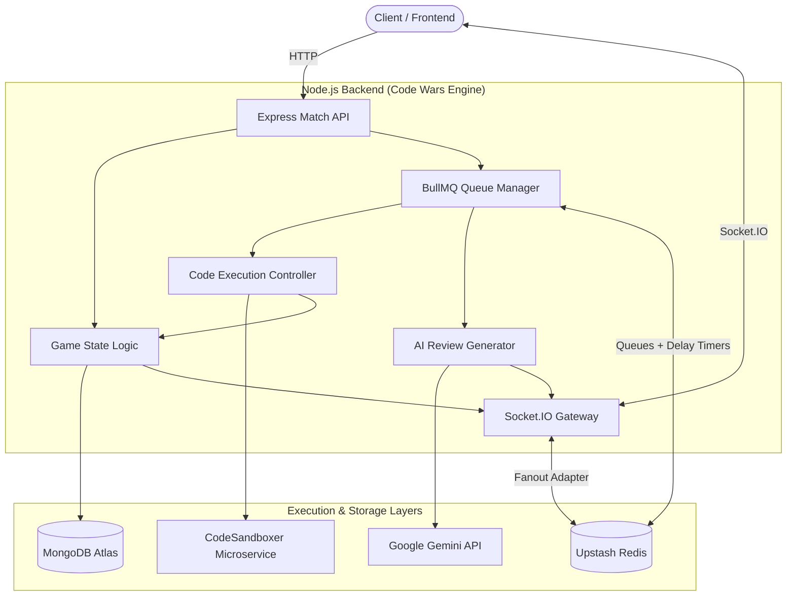

# Code Wars

A real-time, head-to-head 1v1 competitive programming platform. Create rooms, challenge peers, and write code in sync with your opponent. Matches run securely on our isolated code execution runner, showing instant feedback, live spectating, and post-match AI-powered feedback.

---

## ⚡ Key Highlights & Architecture

* **Live Editor Sync:** Real-time Monaco editor updates synchronized via Socket.IO, with storage-event-driven configuration (Font Size, Theme, Minimap) configured from the dashboard.
* **Isolated Sandbox Execution:** Code runs against a dedicated microservice (`CodeSandboxer`) utilizing sandboxed runners instead of third-party public APIs (e.g., Piston or Judge0), ensuring fast execution, custom comparator testing, and strict timeout bounds.
* **Resilient Lifecycle & ELO:**
  * Registered users start at a standard baseline of `1200 ELO`.
  * Temporary guest profiles start at `0 ELO` and are automatically filtered out from public ELO Leaderboards.
  * Idle guest documents and matching history are garbage collected by an idempotent background cleanup process after 24 hours.
* **Scaling Ready:** Redis-backed BullMQ queues handle code submissions, delay timers, and pub-sub socket fanout across multiple API instances.



---

## 🚀 Quick Start

### 1. Prerequisites
* **Node.js** `>= 20.0.0`
* **MongoDB** (Local instance or Mongo Atlas URI)
* **Redis** (Local or Upstash connection string)
* **CodeSandboxer** (Running instance URL)
* *Optional:* **Google Gemini API Key** (for post-match AI code analysis)

### 2. Dependency Installation
Install dependencies in both directories:
```bash
# Backend
cd battle-engine
npm install

# Frontend
cd ../battle-frontier
npm install
```

### 3. Environment Setup
Configure your environment variables before booting.

Create `battle-engine/.env`:
```env
PORT=3000
MONGO_URI=mongodb://localhost:27017/codewars
REDIS_URL=redis://localhost:6379
CORS_ORIGIN=http://localhost:2000
CODESANDBOXER_URL=http://localhost:4000
GEMINI_API_KEY=your_gemini_api_key
EXECUTION_REQUEST_TIMEOUT_MS=10000
```
*Note: If `REDIS_URL` is omitted, the backend falls back gracefully to local memory mode for queues, though this is not recommended for production.*

Create `battle-frontier/.env`:
```env
VITE_API_GATEWAY_URL=http://localhost:3000
VITE_WS_GATEWAY_URL=http://localhost:3000
```

### 4. Running Locally
Launch both servers concurrently:
```bash
# Start backend (http://localhost:3000)
cd battle-engine
npm run dev

# Start frontend (http://localhost:2000)
cd ../battle-frontier
npm run dev
```

---

## 🛠️ Production Readiness

Before pushing to staging or production, run the automated health check script to verify configuration integrity:
```bash
cd battle-engine
npm run check:prod
```
The script validates database availability, environment keys, queue setups, and connectivity to `CodeSandboxer`.

### Recommended Hosting Setup
* **Frontend:** Hosted on **Vercel** (framework preset: Vite)
* **Backend:** Hosted on **Render** (as a Web Service with Node runtime)
* **Database & Queues:** MongoDB Atlas + Upstash Redis (Serverless)

Make sure the backend's `CORS_ORIGIN` environment variable is updated to point exactly to your Vercel deployment domain.

---

## 🤝 Contributing & License
Feel free to open issues or pull requests. Clean up unused styling and run `npm run lint` inside both packages before committing.

Distributed under the MIT License. See `LICENSE` for details.
