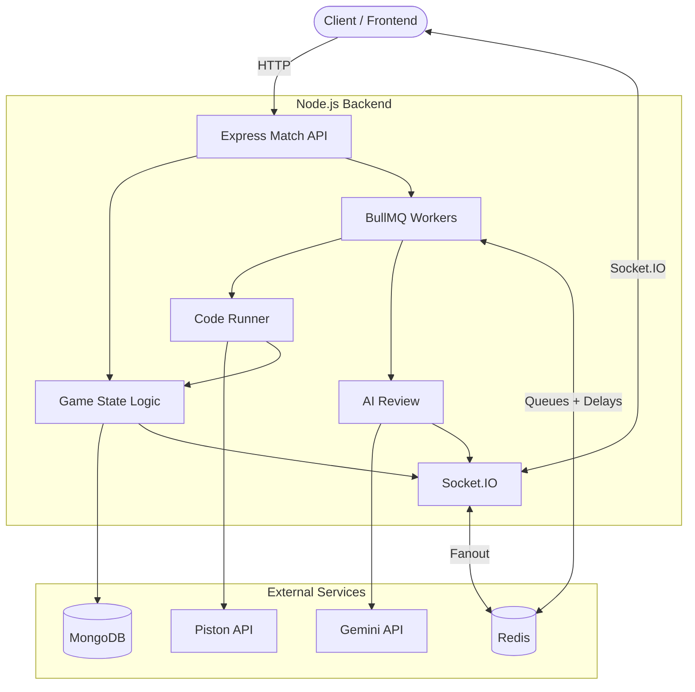

# CodeBattle

## Real-Time 1v1 Competitive Coding Platform

CodeBattle turns competitive programming into a live head-to-head duel. Players create a room, share a code, solve the same problem at the same time, and get real-time feedback as submissions are run.

## Features

- Live 1v1 coding battles with synchronized timers
- Room codes for quick create/join flow
- Multi-language code execution through the Piston API
- Real-time match updates with Socket.IO
- MongoDB-backed matches and questions
- Redis-backed Socket.IO fanout, background jobs, and match timers for scale
- Optional Gemini-powered post-match code analysis
- React + Vite frontend with Monaco Editor

## Architecture



## Match Lifecycle

1. A player creates a room and selects a match duration.
2. A second player joins with the room code.
3. The backend starts the race, stores the timer, and broadcasts the start event.
4. Players run tests or submit final solutions.
5. The backend executes code through Piston and broadcasts verdicts.
6. The first accepted final submission wins, or the match expires when time runs out.

## Quick Start

### Prerequisites

- Node.js 18+
- MongoDB local instance or Atlas connection string
- Optional Gemini API key for AI review

### Install

```bash
cd battle-engine
npm install

cd ../battle-frontier
npm install
```

### Environment

Create `battle-engine/.env`:

```env
PORT=3000
MONGO_URI=mongodb://localhost:27017/codebattle
REDIS_URL=redis://localhost:6379
CORS_ORIGIN=http://localhost:2000
GEMINI_API_KEY=your_gemini_key_here
```

`REDIS_URL` is optional for local development, but use it in production so multiple backend instances can share Socket.IO events, queued work, and delayed match timers. For production you can also set `REQUIRE_REDIS=true`, `RUN_WORKERS=false` on API-only instances, `RUN_WORKERS=true` on worker instances, and `BULLMQ_PREFIX=codebattle` for the Redis key namespace.

The BullMQ queue names are `code`, `analysis`, and `timers`; the Redis keys are namespaced by `BULLMQ_PREFIX`. If Redis is optional and unavailable, `/health` reports `redis.mode` as `local-fallback`.

For production, set `NODE_ENV=production`, `REQUIRE_REDIS=true`, explicit `CORS_ORIGIN`, and run the backend readiness check:

```bash
cd battle-engine
npm run check:prod
```

The backend includes request IDs, security headers, Redis-backed rate limits, bounded code payloads, external API timeouts, graceful shutdown, and active match timer recovery.

Create `battle-frontier/.env`:

```env
VITE_API_GATEWAY_URL=http://localhost:3000
VITE_WS_GATEWAY_URL=http://localhost:3000
```

### Run

```bash
cd battle-engine
npm run dev
```

```bash
cd battle-frontier
npm run dev
```

The backend defaults to `http://localhost:3000`. The frontend runs on `http://localhost:2000`.

## Tech Stack

| Layer | Technology |
| --- | --- |
| Backend API | Express |
| Real-time updates | Socket.IO with Redis adapter |
| Background jobs | BullMQ and Redis |
| Database | MongoDB and Mongoose |
| Code execution | Piston API |
| AI review | Google Gemini |
| Frontend | React, Vite, Tailwind CSS, Monaco Editor |
